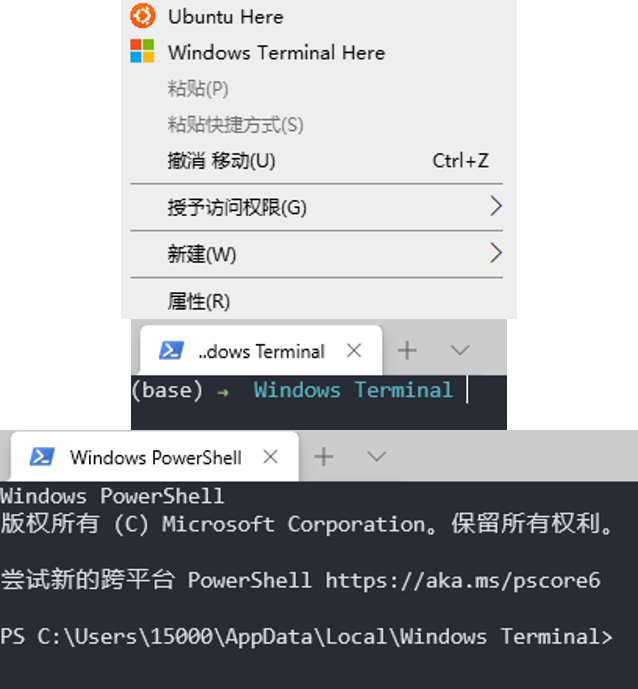

# 添加右键菜单

众所周知，右键菜单打开terminal是正常操作系统都应该具备的一项功能。虽然windows没有，但是可以自己添加。

这里我添加了windows terminal（默认打开powershel）和wsl（ubuntu20.04）到右键菜单中。

只需要创建这两个reg文件：

```reg
Windows Registry Editor Version 5.00
 
[HKEY_CLASSES_ROOT\Directory\Background\shell\wt]
@="Windows Terminal Here"
"Icon"="C:\\Users\\15000\\AppData\\Local\\Windows Terminal\\wt.ico"
 
[HKEY_CLASSES_ROOT\Directory\Background\shell\wt\command]
@="C:\\Users\\15000\\AppData\\Local\\Microsoft\\WindowsApps\\wt.exe"
```

第二个：

```reg
Windows Registry Editor Version 5.00
 
[HKEY_CLASSES_ROOT\Directory\Background\shell\ubuntu]
@="Ubuntu Here"
"Icon"="C:\\Users\\15000\\AppData\\Local\\Windows Terminal\\ubuntu.ico"
 
[HKEY_CLASSES_ROOT\Directory\Background\shell\ubuntu\command]
@="C:\\Users\\15000\\AppData\\Local\\Microsoft\\WindowsApps\\wt.exe wsl"
```

然后双击这两个reg添加到注册表中即可。至于reg文件的语法，我也懒得搞明白，但是这段文件中的命令、icon位置这些应该还是能看懂的。啊对了，如果要把图片转换成ico格式的话，用`ffmpeg -i a.png a.ico`命令即可。

不过还有一点要注意，就是wt默认的setting.json的profile里面设置的startingDirectory都是"%USERPROFILE%"，也就是home目录。可以把相应的profile的这个项的值改成null，这样就可以在当前目录打开了。或者也可以在reg的命令中加入`-d .`

效果图：

<div align="center">
    
</div>

---

12.16更新

可以在regedit里直接以可视化的形式编辑

在`HKEY_CLASSES_ROOT\*\shell`目录下编辑的话，这个效果可以作用到所有文件；上面的`HKEY_CLASSES_ROOT\Directory\Background\shell`作用的效果是在文件夹空白处右键。

作用到文件（比如用vscode打开一个文件），必然要指定一个参数，这个用`%1`就行。比如`"path\to\vscode" "%1"`

指定ico的值也可以直接用exe文件的path。

这个[地址](https://stackoverflow.com/questions/20449316/how-add-context-menu-item-to-windows-explorer-for-folders)似乎说的比较清楚。

