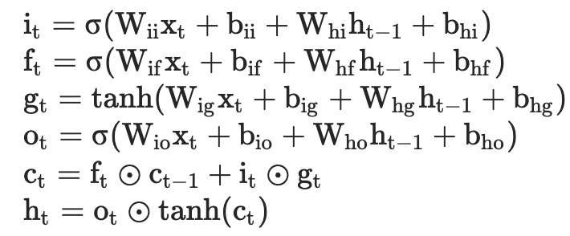
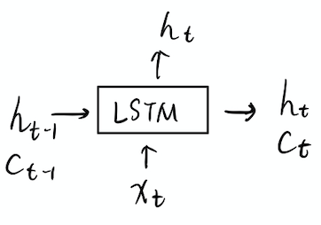
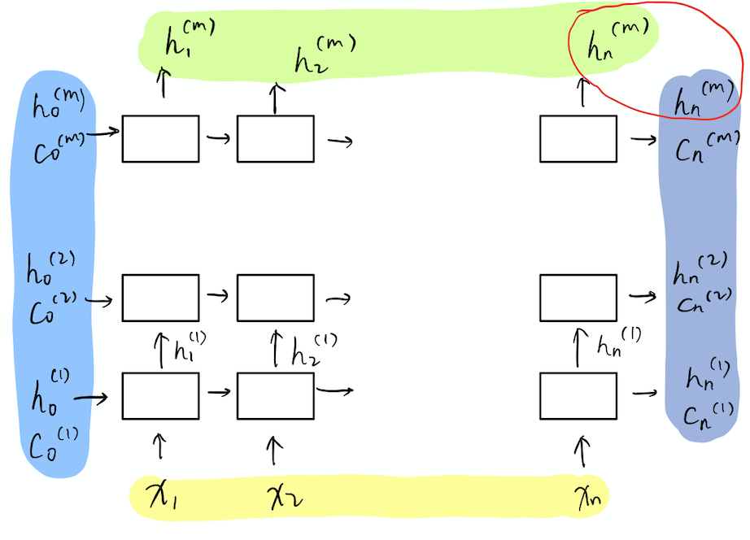

### LSTM


#### 计算公式

x_t是时序t的输入，h_(t-1)是前一个隐状态（hidden），而c_(t-1)是前一个时序的内部状态（cell）。

<!--  -->
<div align="center">
    
</div>
<!-- 额，好像公式编辑一时半会儿弄不好orz -->

上面的公式几个分别是输入门，遗忘门，data信息，输出门，candidate和hidden输出。

总之，就是LSTM自己附带了cell状态，每个时序输入x和隐状态h，输出新的隐状态，并且更新自己内部的cell。

有些版本的LSTM公式里还会有一步，用h_t生成该时序的LSTM输出y_t的过程。但是在pytorch中是没有的。

#### LSTM Module

来看一下参数列表：
- input_size – 输入x的维度

- hidden_size – 输出h的维度

- num_layers – 堆叠层数。后一层用前一层的h输出作为输入x。默认为1

- bias – 计算公式中是否带偏置项b。默认True

- batch_first – 模型的输入与输出是否把第一维设置成batch。注意，只有input和output！没有h与c。默认False。

- dropout – 在堆叠的LSTM中，各层之间使用的dropout rate。默认0。

- bidirectional – 是否用双向LSTM。默认False

输入与输出：

- 输入：`input, (h_0, c_0)`
    - input： [seq len, batch size, input size]，如果使用pack_padded_sequence会更复杂一些。（若batch_first为True则维度为[batch size, seq len, input size]）
    - h_0： [num layer * num direction, batch size, hidden size]
    - c_0： 与h_0一样

- 输出：`output (h_n, c_n)`
    - output： [seq len, batch size, num direction * hidden size]，如果使用pack_padded_sequence会更复杂一些。（若batch_first为True则维度为[batch size, seq len, num direction * hidden size]）
    - h_n与c_n，维度都与h_0和c_0一样

另外，pytorch还有一个LSTMCell的Module，它相当于LSTM里一层的单个时序的操作，而且只有单向。在LSTM的num_layers为1，bidirectional为False的时候，两者的参数是一样的。

#### 图解

这是一个LSTMcell。

<!--  -->
<div align="center">
    
</div>

这是一个多层的LSTM：

<!--  -->
<div align="center">
    
</div>

黄色部分表示输入input，绿色是输出output，蓝色则是h与c，较淡的是0，深的是n。从这个图中也可以看到，input的shape应该是[seq len, batch size, input size]，output是[seq len, batch size, hidden size * num direction]。而h与c则都是[num layer * num direction, batch size, hidden size]。

还可以看出，output与h_n最后是有部分重合的。具体来说是，单向的情况：

```python
output[-1] == h_n[-1]
```

双向的情况：
```python
output[-1, :, :hidden_size] == h_n[-2,]
output[0, :, hidden_size:] == h_n[-1]
# 反向的最终的h对应output[0]
```

<!-- 还应该写一下encoder的h在decoder怎么用，还有pack之类的 -->

