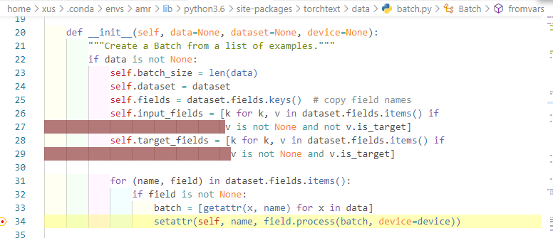

# 探讨一下指针网络

众所周知，指针网络最后预测的词表概率分布由两部分组成，第一部分是decoder的预测，经过全连接层和softmax；第二部分是基于对source端token的attention。

整个模型的想法倒是很简单，但是真的到实现的时候，遇到了各式各样的问题，这里就稍微探讨一下。ps，template里那个指针网络的模板，现在看来其实挺粗糙的。。。

## source和target共享词表

我一开始就简单地认为，指针网络这种特殊的copy机制要求这两个词表必须共享。

共享了有什么好处呢？主要就是两部分预测概率可以通过比较简答的方式加权求和，可以比较简单容易地实现。

但是有什么坏处呢？

- 首先如果source和target的词表分布很不一样，那么共享了词表之后模型里就有相当一部分的参数是用不上的。embedding和最后的预测linear里都是。

- 其次共享词表这个方式不太容易在torchtext的框架中实现。torchtext是基于field处理、得到vocab的，而source的field不需要init_token和eos_token，但对于target的field这两者是必需的。所以如果共享field的话，source的输入会多两个不必要的token，这对不擅长处理长序列的lstm或许会带来影响；另一种方式是用target field来build_vocab，然后source field通过setattr设定词表，这样可以解决部分问题。

## 不共享词表的模式

一开始我觉得不可思议，后来学长和我说了一下openNMT里的实现方式，感觉可以参考一下。

首先就是用两个field，针对source和target各自构建自己的词表，比方说，source端有8000个词，target端有10000个。

然后就是各个样本内部的处理。比如这个样本的source内部有30个token，25个不重复的，其中20个出现在target的词表中5个没有出现；target中有3个不重复的token没有出现在自己的词表里，但是出现在了source里面。那么，在这个样本numericalize的时候，可以把target的数据的index编号变为`0-10004`。最后5个编号对应那5个source里出现但是没有在target中出现的token。当然，因为target中只出现了3个token，所以这5个编号不可能全占。

再考虑模型如何处理。训练的时候，每个时序得到一个decode概率分布和attention概率分布。首先把30个attention中重叠的部分合并起来，得到一个对25个token的attention分布。然后把这25个中20个出现在target词表中的加到decode概率分布里面（1w维），而那5个不出现的则作为最后5个维度分布加进来，得到10005维度的概率分布。这个操作需要什么呢？其实只需要source和target的词表，以及source的indices即可。

回过头来看，这套模式其实是很麻烦的。模型处理的时候合并两部分概率分布其实还算简单了，主要是样本处理的时候更麻烦。torchtext的dataset是基于example得到的，example中还是token的list，只有到构建Iterator，并且调用__iter__函数的时候，才会把token的list转换成tensor。这一部分的代码最终在`torchtext/data/batch.py`的Batch类的__init__函数中，通过调用field的process函数实现（34行）。

<div align="center">
    
</div>

可以看到，在field的处理规则的限制下，做不到同时处理source和target，它们都是各自用各自的field处理的。

可以怎么hack呢？我现在想到的方式，就是继承原来的这个Batch，重写它的构造函数。而Iterator因为import了这个Batch类，所以也要重新写过，考虑到也不能直接修改库的代码，所以最好把`torchtext/data/iterator.py`复制一份到当前工程的目录，然后改了它的import。。。

emmm就写到这里吧。。。以后有什么更好的想法接着写。。。

### 12.23更新

学到了，其实不用那么大费周章。只需要在执行load_dataset的代码中加入这么几段：

```python
from torchtext.data import Batch
# 定义Batch新的构造函数，参数什么的都从原始的那个里copy即可
def ff():
    pass
Batch.__init__ = ff
```

我在测试的时候，在原始的构造函数最前面加了个print，结果执行的时候确实可以print出来。

另外要注意，这种情况是别的地方没有代码用到这个Batch类，所以我可以肆无忌惮地改它绑定的方法。不过这段代码写的位置似乎没有讲究，在`import Iterator`了之后再写似乎也没什么问题，当然肯定是要在遍历Iterator之前修改的。

在另外一种情况，你在自己别的地方的代码里用到了原始的Batch类，但是Iterator中用的那个Batch则无所谓，你希望只修改那里的Batch的代码。可以这样操作：

```python
import torchtext.data.iterator as it
from torchtext.data import Batch
class MyBatch(Batch):
    def __init__(self, data=None, dataset=None, device=None):
        pass
it.Batch = MyBatch
```

这样修改的是iterator.py这份代码里的Batch，而不会影响到外部别人使用的Batch。
