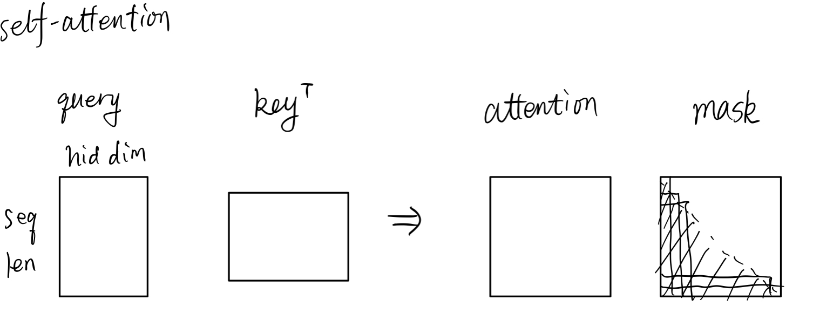
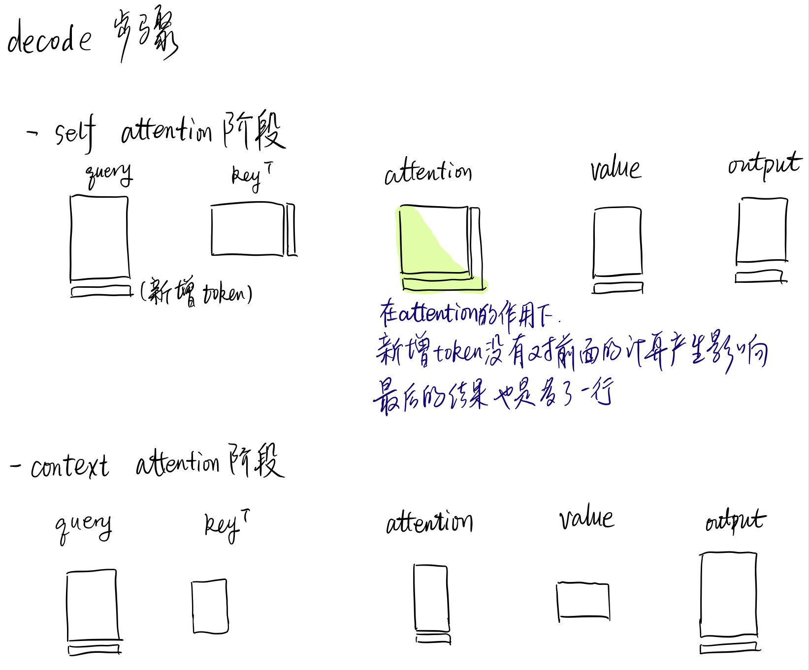

# 大名鼎鼎的xfmr

这里应该插一幅图

如图所示，transformer中最重要的结构就是attention。

## multi-head attention

先看不multi-head的情况。计算的关键就是query、key和value。需要记住一点，key和value始终是绑定的。后面简记为qkv。（绑定仅限这里的分析，如果有别的情况，可以灵活变动，只需k与v的shape一样即可）

这三个都是通过input（后面记为q0 k0 v0与qkv区分，而且k0应该和v0是同一个）和对应的Linear层计算得到的。这里把batch size的因素也忽略掉，可以视它们的shape分别为`[query len, hid dim], [key len, hid dim], [value len, hid dim]`（其中value len等于key len）。
具体的attention计算公式如下：
$$
output = Attn(q0, k0) = Attention(q, k, v) = softmax(q k^T / sqrt(d_k))V
$$

softmax里面那一坨就是attention了，它的shape是`[query len, key len]`，再与v乘后得到的结果是`[query len, hid dim]`。

所谓multi-head就是这样的计算用多套不同的参数重复，最后得到的结果concat起来，是不是感觉和batch很像呢？所以如果要把batch size和head num的因素考虑进来，无非也就是在前面多了两个维度罢了。

注意，这里的计算是没有mask的，在decoder中不可避免地要考虑到mask。不过mask的情况其实也没有复杂多少，只要在softmax之前做mask即可。

## 结构

和大部分序列生成模型一样，基于xfmr的seq2seq模型也是encoder+decoder的结构。因此计算的时候大致也可以分成encoder和decoder两部分的计算。

//encoder layer与decoder有个小区别。encoder layer是同时用input做q0和k0，然后做self mha。这之后通过add（也就是残差）+layernorm，得到layer的输出。最后再通过全连接层（feedforward）+残差layernorm，得到最终的输出。

//而decoder layer也是先用input做q0和k0做self mha、残差等。然后用前面的这个输//出做q0，用encoder得到的最终output做k0，进行第二次mha+残差（这个叫context attention）。最后再进行一次全连接层+残差。

上面说了两段废话，其实还是直接去看最上面那个图更直观也更容易理解。

## train

分两步走，第一步通过多层encoder layer的计算，得到encoder最终的output。

但是在decoder layer的时候，要注意，因为seq2seq的生成模型是单向的，所以一定要保证前面的token不能attend到后面的。也就是说，每个batch内部，需要一个左下三角形的mask。再考虑上batch的因素，mask应该长这样：

    

这样得到的decoder最终output经过全连接层+softmax就是预测的词表分布。在有mask的时候，所有的预测分布是可以同时计算的（不同于lstm一定是有先后顺序）。输入是target序列（包含bos，不包含eos），目标是不包含bos但包含eos的，也就是right-shift的序列。

## decode

decode的步骤就会复杂一点。但大致上也是两步走，第一步计算encoder的输出，这个其实和train的时候没有任何区别。

在decoder decode token的时候，其实可以进行增量式的计算。

在这里需要先讨论一下，decode的时候，是否需要对后面的token做mask。我之前有考虑过，如果decode采用类似于dropout那种“训练的时候drop，decode不drop”的方式，也就是不mask后面的token。如果真的这样做，那么会导致每个decode时序self-attention得到的输出都不相同，导致不能增量式地decode。但看别人的代码好像还是mask掉后面的，那好吧，这里也mask好了。

现在在mask的前提下讨论。既然已经mask了，那self-attention的时候，后面新增的token对前面的attention计算、output计算就完全没有影响了。在context attention的时候更没有影响。因此，就是后一个decode时序，比前一个decode时序，query多了一行vector，仅此而已。decode的时候（在self attention时），只需要对这行多出来的vector进行操作，也就相当于query len强制变成了1。但是key和value就可以作为保存的状态，每次decode的时候先取出来，然后更新（增加一行），再做self-attention的计算。如果是context attention就更简单了，计算一次key和value，就可以保存起来，以后也不用更新。

这里应该贴一段代码。

关于增量式decode的示意图：

    

todo:写一遍增量式decode的代码。
