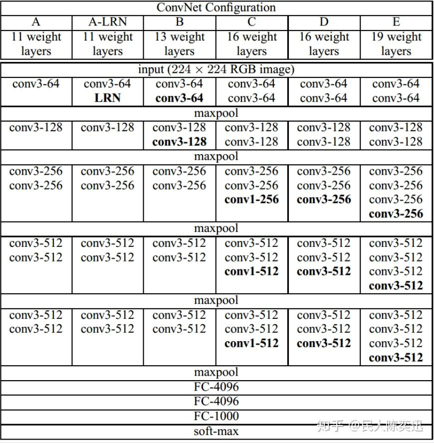

# VGG Net
VGG是14年提出来的工作，里面用的卷积全是3 * 3的，pooling用的都是2 * 2的maxpooling。
VGG有两个版本，16和19，区别其实就是19比16多了三个卷积层。

输入是一个(3, 224, 224)的image，输出的是对这个image的编码（大概）。

关于VGG的结构，其实看了这两个图就能明白了，不需要多说什么。
<div align="center">
    
</div>

<div align="center">
    
</div>


试着写一下VGG的代码：
```python
import torch
import torch.nn as nn

arch_16 = [64] * 2 + ['m'] + [128] * 3 + ['m'] + [256] * 3 + ['m'] + [512] * 3 + ['m'] + [512] * 3 +['m']
arch_19 = [64] * 2 + ['m'] + [128] * 3 + ['m'] + [256] * 4 + ['m'] + [512] * 4 + ['m'] + [512] * 4 +['m']

def make_layers(arch):
    in_channels = 3
    layers = []
    for v in arch:
        if v == 'm':
            layers.append(nn.MaxPool2d(kernel_size=2, stride=2))
        else:
            conv = nn.Conv2d(in_channels, v, kernel_size=3, padding=1)
            # 用了batch norm
            layers += [conv, nn.BatchNorm2d(v), nn.ReLU(inplace=True)]
            in_channels = v
    return nn.Sequential(*layers)

class VGG(nn.Module):
    def __init__(self, output_dim=384, arch=arch_19):
        super().__init__()
        self.vgg = make_layers(arch)
        self.avgpool = nn.AdaptiveAvgPool2d((7, 7))
        self.linear = nn.Sequential(
            nn.Linear(512*7*7, 4096),
            nn.ReLU(inplace=True),
            nn.Dropout(),
            nn.Linear(4096, 4096),
            nn.ReLU(inplace=True),
            nn.Dropout(),
            nn.Linear(4096, output_dim),
        )

    def forward(self, x):
        x = self.vgg(x)
        x = self.avgpool(x)
        x = torch.flatten(x, 1)
        x = self.linear(x)
        return x
```

和大部分CNN一样，VGG的参数量主要都是在后面的隐藏层，这个版本的VGG的参数量高达100+M个orz、
